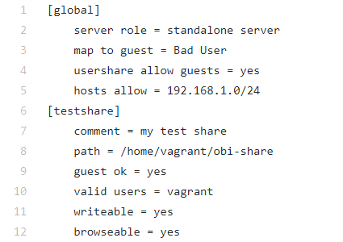
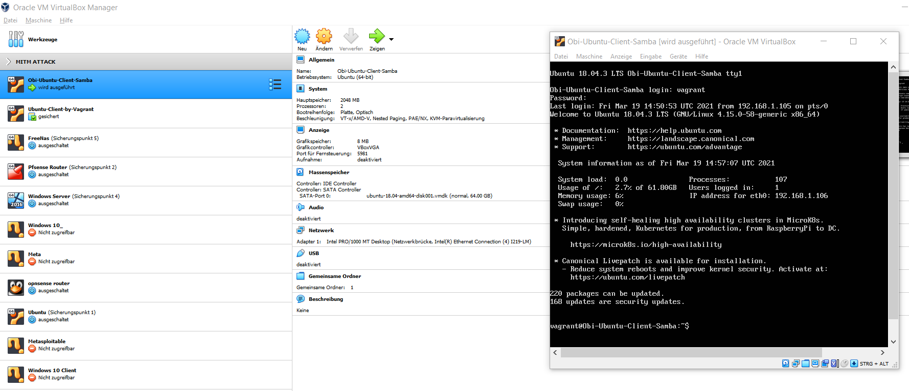
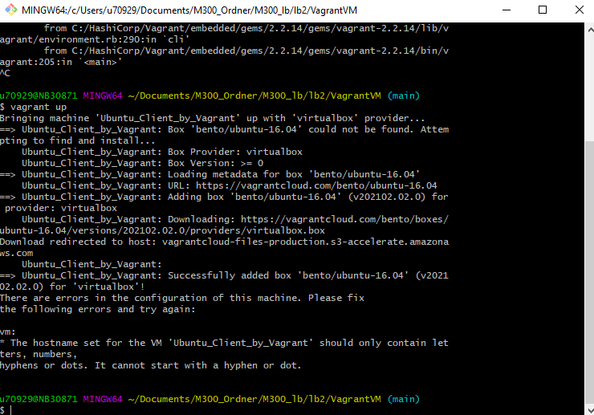
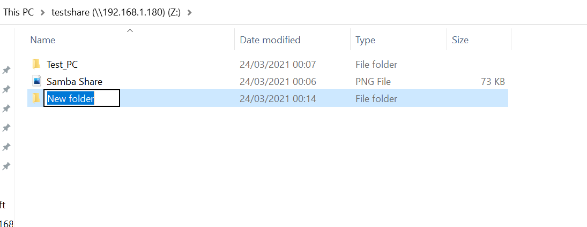
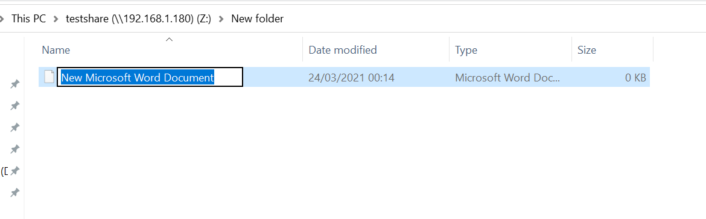
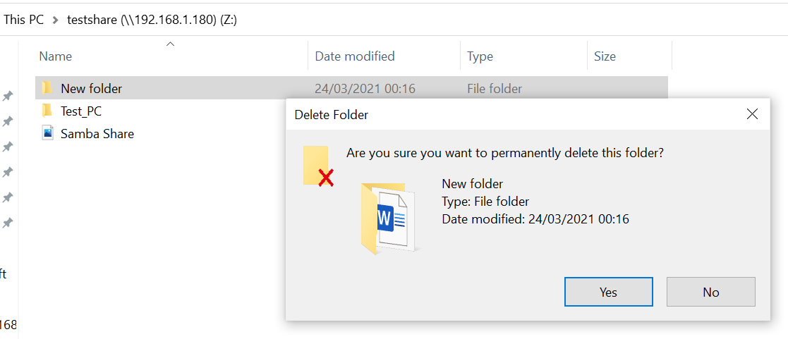

## M300 Lernbeurteilung 2 | Dokumentation
### von Obinna Maduabum    
---
## Inhaltsverzeichnis
* Einleitung
  * Anforderung
* VM erstellen
* Samba Dienst starten
* Samba Share erstellen
* Grafische Übersicht
* Testing
* Quellenangaben
* Angewendete Befehle
## Einleitung
___
Ich gehe so vor, indem ich zuerst einen Vagrant VM vom File ertstelle. Danach werde ich auf den VM alle Samba Einstellungen und Konfigurationen machen. Wenn alles funktioniert, werde ich die Befehle dann in der Vagrantfile hinzufügen. Dabei werde ich immer testen, ob alles gut läuft.
### **Anforderungen** 

Um diese Setup aufzubauen habe ich folgendes zur Verfügung gestellt.
  * Vagrant
  * Git hub/lab
  * Git bash
  * Visual Studio Code
  * Virtualbox
  * Speicherplatz für die VMs

 

## Virtuelle Maschine Layout Erstellen
___
### VM Ordner für Vagrant erstellen
In gewünschtem Verzeichnis einen neuen Ordner für die VM anlegen:

  > ``cd m300_lb/lb2`` 
  > ``mkdir VagrantVM`` 

### Vagrantfile Vorlage erzeugen:
Ins Verzeichnis wechseln und dort die eine Vagrantfile Vorlage erzeugen.

  > ``cd VagrantVM`` 
  > ``vagrant init`` 

A Vagrantfile has been placed in this directory. You are now
ready to `vagrant up` your first virtual environment! Please read
the comments in the Vagrantfile as well as documentation on
[vagrantup](vagrantup.com) for more information on using Vagrant. 

## Vagrantfile bearbeiten:
Mit diesen Befehl wird einen Vagrant Box erstellt. Ich habe den ubuntu box von "hashicorp" gewählt.
> ``Vagrant.configure("2") do |config|``  
> ``config.vm.box = "hashicorp/bionic64"``

Netzwerkeinstellungen des VMs. Statische Netzwerk IP wird gesetzt und der Bridge muss angegegben sein.
> ``config.vm.network "public_network", ip: "192.168.1.180", bridge: "Intel(R) Dual Band Wireless-AC 8265"``

VM Provider als "Virtualbox setzen"
> ``config.vm.provider "virtualbox" do |vb|``

GUI für den VM deaktivieren
> ``vb.gui = false``

Memory und Anzahl CPUs des VMs bestimmen
> ``vb.memory = "2048"``  
   ``vb.cpus = "2"``

VM Name Setzen
> ``vb.name = "Ubuntu Server by Vagrant"``

Alle Befehle in der Provision "shell" werden nacheinander beim aufsetzen geführt.
>``config.vm.provision "shell", inline: <<-SHELL``

Samba Service installieren. Mit -y Option wird keine Bestätigung verlangt, dass man alle Abhängigkeiten installieren möchte. Dazu noch einen System Update durchführen
>``apt-get install update``  
>``apt-get install -y samba``

## Samba Konfigurationen
Verzeichnis für den Share erstellen und Owner wechseln auf "vagrant"
> ``mkdir /home/vagrant/obi-share``  
> ``sudo chown -R vagrant:vagrant /home/vagrant/obi-share``

SMB File bearbeiten:  
Ich füge hier einen Screenshot meiner smb.conf Datei

Default smb.conf File umbenenen (als Backup)
> ``sudo mv /etc/samba/smb.conf /etc/samba/smb.conf.old``

Neue smb.conf file vom https webseite (Raw File von Github) herunterziehen 
> ``sudo wget -P /etc/samba/ https://raw.githubusercontent.com/Obi1Chris/M300_lb/main/lb2/smb.conf`` 

Mit der "-P" Option wird das File in der angegebene Verzeichnis gespeichert. Somit muss ich der Filename nicht definieren.  

SMB Passwort setzen. Zuerst werde ich Variablen definieren und die im echo Befehl einschreiben. (Echo Ausgabe wird gegrept ins smbpasswd Befehl)
>``USER=vagrant``  
>``PASSW=obi123``
>
>``echo -ne "$PASSW\n$PASSW\n" | sudo smbpasswd -a -s $USER``

Samba dienst neustarten.
>$ ``systemctl restart smbd``  

## Grafische Übersicht 
___

Da füge ich ein Bild vom Virtuelle Maschine in der Virtualbox, den ich mit Vagrant erstellt habe.
 

Hier habe ist ein Bild wo man sieht, wie der Share aussieht wenn man ihm als Netzwerklaufwerk anbindet.  

## Testen
___

### First Try Vagrantfile 
Dies ist mein erster Versuch einer Vagrant VM vom Vagrantfile zu erstellen. Hier hat es nicht geklappt, weil er nicht auf den Box "ubuntu/trusty64" zugreifen konnte. 

  
Ich habe später gemerkt, das dies an einen Netzwerk Problem meines Laptops daran gelegt hat. 

### Second Try Vagrantfile
Beim zweiten Versuch kam eine andere Meldung. Und zwar war dies eine Meldung wegen der Namenskonvention 
  

Dies habe ich dann angepasst und nun hat es funktioniert. 

### Complete Vagrantfile
Dieser Test ensteht nachdem ich alle Einstellungen und Konfigurationen abgeschlossen habe. Dabei werde ich prüfen, dass der Samba Share beim aufsetzen der VM (mit "vagrant up) erstellt wird und auch aktiv ist.  
Danach werde ich testen ob ich mich als User "vagrant" einloggen kann und Änderungen im Share machen kann inklusiv Dateien löschen. 

Hier sieht man, dass der Share erstellt worden ist und ebenfalls aktiv ist:

 
Ordner und Dateien erstellen:  

 

Dateien und Ordner wieder löschen:

 

### Schlusswort
Mit diesen Überprüfungen kann ich bestätigen, dass alles so funktioniert wie es sollte.

## Angewendete Befehle
___
Hier werde ich Befehle dokumentieren, die ich benutzt habe.

### Git Befehle
|Commands|Meaning|
|---------              |:--------                                                          |
|   ``git add ``        |   Add a change to the staging list (to be committed)              |
|    ``git commit``     |   make all changes in the staging list permanent.|
|   ``git push``        |   Creates a default vagrantfile for easy editing                  |
### Vagrant Befehle

|Commands|Meaning|
|---------              |:--------                                                          |
|   ``vagrant init``    |   Creates a default vagrantfile for easy editing                  |
|    ``vagrant up``     |   Creates a Virtualbox VM based on the setting in the vagrantfile.|
|   ``vagrant destroy``    |   Destroys a Vagrant VM in the current folder (if there is one)                 |

### Ubuntu Befehle
|Commands|Meaning|
|---------              |:--------                                                          |
|   ``systemctl  grep ""``    |   Dienst suchen (mit grep kann es spezifiert werden)       |
|    ``systemctl list-unit-files``     |   list systemd services.                           |
|   ``USER=vagrant``    |  Creates a variable that can be used (as $USER)

## Quellenangaben
___
[Markdown Anleitung](https://www.ionos.de/digitalguide/websites/web-entwicklung/markdown/) 

[VM Deployment with Vagrant](https://www.youtube.com/watch?v=sr9pUpSAexE&t=432s) 

[Samba File Sharing](https://www.youtube.com/watch?v=oRHSrnQueak&t=609s) 

[Folder Sharing Linux](https://www.youtube.com/watch?v=x8Lo20C19ao&t=70s) 

[Samba Share on Windows](https://www.youtube.com/watch?v=p2r0kIB_ItE&t=154s) 

[vagrant boxes](https://vagrantcloud.com/search) 

[Mount Shares at Bootup](https://youtu.be/5b3lCE_I3yw) 

[Piping Smbpasswd](https://stackoverflow.com/questions/12009/piping-password-to-smbpasswd)