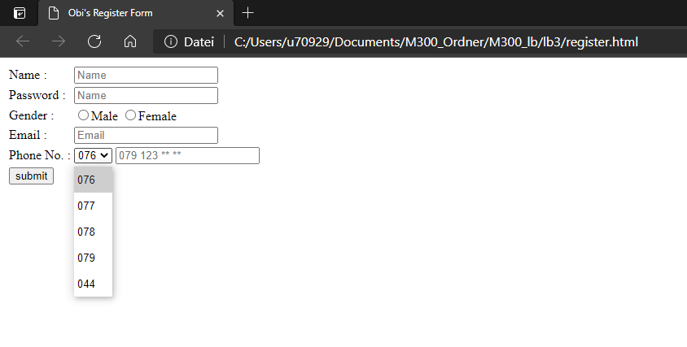
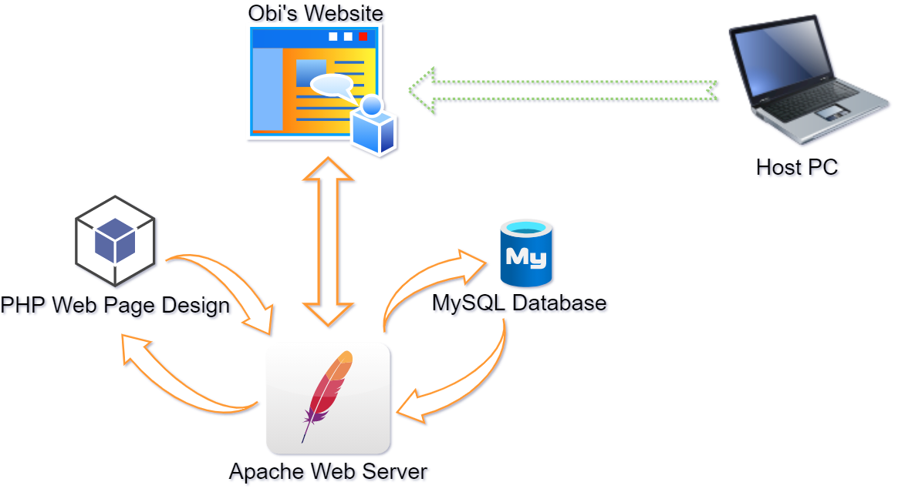
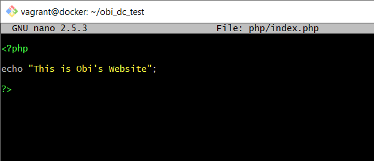
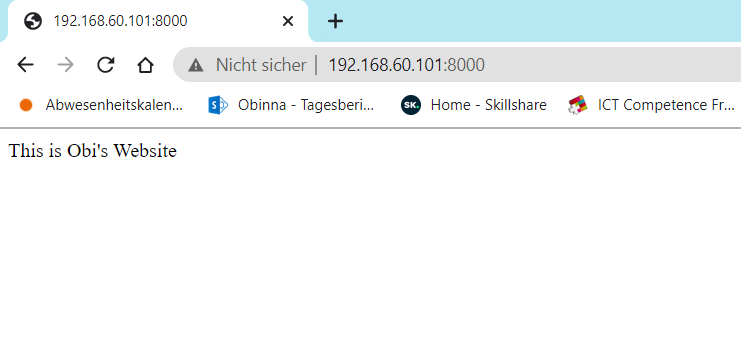
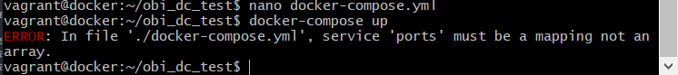
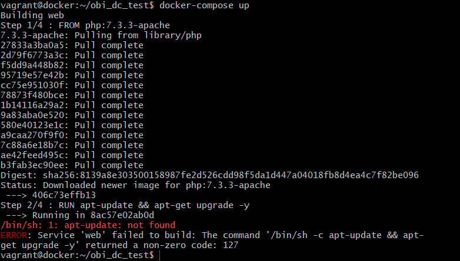
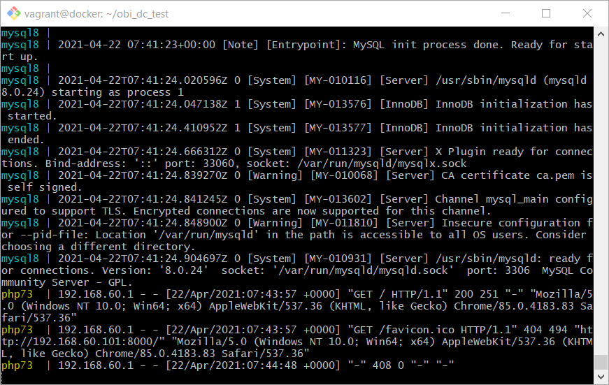
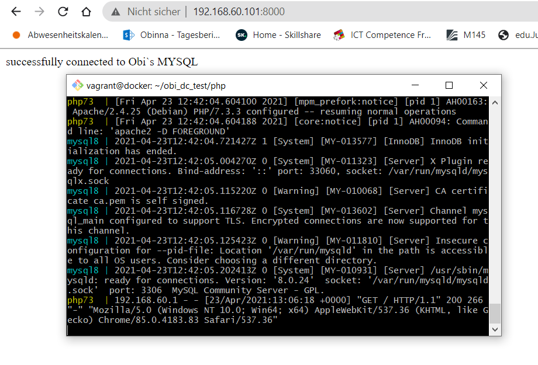

## M300 Lernbeurteilung 3 | Markdown Dokumentation
### von Obinna Maduabum    
---
## Inhaltsverzeichnis
* Einleitung
  * Anforderung
* Docker VM erstellen
* PHP & Apache Dienst installieren
  * Docker-compose File
*  MySql Dienst Installieren
   *  Docker File Image
   *  Docker-Compose File
* Create HTML Form Page
* Connect Form to Database
* Grafische Übersicht
* Testing
  * PHP + Apache
  * MySQL
* Quellenangaben
* Angewendete Befehle
## Einleitung
___

Mein Ziel ist es eine Webformular anhand PHP und Apache zu erstellen und wenn man diese Formular ausfüllt, werden die Daten in meiner MySQL Datenbank gespeichert. <p>
Ich beginne indem ich eine PHP-Apache Dienst starte und eine einfache Webseite anzeigen lassen. Wenn dies funktioniert, werde ich einen eigenen Docker Image erstellen, worin die PHP-Apache Dienst mit den vom MySQL verknüpft ist. Nachdem ich die Verbindung bestätigen kann, werde ich dann die Webformular erstellen und es so konfigurieren, dass die eingegebene Daten in mein erstellte Datenbank hinzugefügt werden. 

### **Anforderungen** <p>
Um diese Setup aufzubauen habe ich folgendes zur Verfügung gestellt.
  * Vagrant
  * Docker (inkl. Docker-compose)
  * Git hub/lab
  * Git bash
  * Visual Studio Code
  * Virtualbox
  * Speicherplatz für die VMs
<p> 


## Docker VM Erstellen
___
### VM Ordner für Docker VM erstellen
In gewünschtem Verzeichnis einen neuen Ordner für die VM anlegen:

  > ``cd m300_lb/lb3``<br>
  > ``mkdir DockerVM``<br>

Um den Docker Virtuelle Maschine zu erzeugen habe ich Vagrant benutzt. Ich habe einen Vagrantfile verwendet den der Lehrer für uns zur Verfügung gestellt hat .<br>

Die Netzwerk Einstellung wurde vom Lehrer vorgegeben.

### Docker-Compose Kommando installieren:
Damit die "Docker-Compose" Befehl angewendet kann, muss dies im Docker VM noch installiert werden:
> ``sudo curl -L "https://github.com/docker/compose/releases/download/1.23.2/docker-compose-$(uname -s)-$(uname -m)" -o /usr/local/bin/docker-compose`` <p>

Danach noch die Berechtigung anpassen (ausführbar machen):<br>
>``sudo chmod +x /usr/local/bin/docker-compose``


## PHP und Apache Dienst installieren
___

### Verzeichnis für Umgebung anlegen
Für die ganze Umgebung werde ich einen neuen Verzeichnis anlegen und in dies wechseln.
 >``mkdir obi_dc_test`` <br>
 >``cd obi_dc_test/``

### Docker Compose YAML File erstellen

```Ruby
version: '3.3'
services:
    web:
       image: php:7.3-apache
       container_name: php73
       volumes:
         - ./php:/var/www/html/
       ports:
         - 8000:80
```
Den Image ist eine PHP Dienst der inklusive als Apache Webserver verwendet werden kann. <br>
Ich habe einen Volume erstellt, die den lokallen Verzeichnis "/php" auf den Remote Verzeichnis "/var/www/html/" verknüpft.<br>
Ich habe einen Port Forwarding vom Port 8000 zur Port 80 konfiguriert. Somit muss ich nur den Port 8000 angeben und es wird intern auf Port 80 weitergeleitet. <br>

  
## MySQL Dienst installieren
___

### Dockerfile Image

Anstatt den bisher verwendete php-apache Image werde ich einen Image selbst erstellen, die zusätzlich noch eine MySQL Support anbietet.<br>
Dafür werde ich einen Dockerfile erstellen:

```Ruby
FROM php:7.3.3-apache
RUN apt-update && apt-get upgrade -y
RUN docker-php-ext-install mysqli
EXPOSE 80
```

### Custom Image beim Docker-compose File verwenden
Ich werde meine custom Image nun am Docker-compose file hinzufügen:
```Ruby
version: '3.3'
services:
    web:
      build: 
        context: ./php
        dockerfile: Dockerfile
      container_name: php73
      volumes:
        - ./php:/var/www/html/
      ports:
        - 8000:80
    
```
Nun werde ich im compose file noch eine zweite Docker Container erstellen für den MySQL Datenbank.

```Ruby
db:
      container_name: mysql8
      image: mysql:8.0
      command: --default-authentication-plugin=mysql_native_password
      restart: always
      environment: 
        MYSQL_ROOT_PASSWORD: root
        MYSQL_DATABASE: Obi_test_db
        MYSQL_USER: Obisql 
        MYSQL_PASSWORD: obipass123
    ports: 
        - 6033:3306
```
Als Authentifizierung möchte ich einen native Passwort verwenden den ich angeben werde.<br>
Mit ``restart: always`` wird der Container immer neu gesstartet, wenn er manuell angehalten wird oder der Docker-Daemon selbst neu gestartet wird.<br>
Im ``environment`` setze ich bestimmte Variabeln wie Root Passwort, Datenbank Name, DB User, und DB Passwort.<br>
Mit der Port "6033" wird die Verbindung zu unseren lokalen SQL Port auf "3306" weitergeleitet.<p>

Nun werde ich dies testen und zwar im Testing , MySQL Service

## Verknüpfung MySQL Service mit PHP
___

Mein Ziel ist, dass ich den PHP Apache Service mit dem MySQL Service verbinde. <br>
Dabei soll es möglich sein die Daten eines vorhandenes Datenbank auf die Webseite anzuzeigen. Um zu testen, dass dies möglich wäre, habe ich den PHP Index File angepasst, so dass er eine Verbindung zum MySQL Server beweisen kann. Wenn die Verbindung erfolgreich aufgebaut wurde, dann steht auf der Website "Connection Successfull" ansonsten "Connection Failed".<br>
Damit dies überhaupt möglich ist, muss ich die Container verknüpfen. Dies mache ich indem ich der PHP Container abhängig vom MySQL Container mache:
```Ruby
depends_on:
      - db
```

### MySQL Connection in PHP
Jetzt erstelle ich im PHP Index File eine Verbindung. Anhand ``IF`` und ``ELSE`` Kriterien wird eine Bestätigung der Verbindung auf der Webseite angezeigt.
```Ruby
<?php
$host = 'db'; 
$user = 'Obisql';
$password = 'obipass123';
$db = 'Obi_test_db';

$conn = new mysqli($host,$user,$password,$db);
if($conn->connect_error){
    echo 'connection failed' . $conn->connect_error;
}
echo 'successfully connected to Obi`s MYSQL';

?>
```

### HTML Form für Datenbank erstellen
Ich habe nun einen HTML Form erstellt, die Angaben zur eine Person abfragt.
```Ruby
<!DOCTYPE html>
<html>
<head>
    <meta charset='utf-8'>
    <meta http-equiv='X-UA-Compatible' content='IE=edge'>
    <title>Obi's Register Form</title>
    <meta name='viewport' content='width=device-width, initial-scale=1'>
    <link rel='stylesheet' type='text/css' media='screen' href='main.css'>
    <script src='main.js'></script>
</head>
<body>
<form>
    <table>
        <tr>
            <td>
                Name :
            </td>
            <td>
                <input type="text" placeholder="Name" name="" >
            </td>
        </tr>
        <tr>
            <td>
                Password :
            </td>
            <td>
                <input type="password" placeholder="Name" name="" >
            </td> 
        </tr>
        <tr>
            <td>
                Gender :
            </td>
            <td>
                <input type="radio" name="Gender" >Male
                <input type="radio" name="Gender" >Female
            </td> 
        </tr>
        <tr>
            <td>
                Email :
            </td>
            <td>
                <input type="mail" placeholder="Email" name="" >
            </td> 
        </tr>   
        <tr>
            <td>
                Phone No. :
            </td>
            <td>
                <select>
                    <option>076</option>
                    <option>077</option>
                    <option>078</option>
                    <option>079</option>
                    <option>044</option>
                </select>
                <input type="Phone" placeholder="079 123 ** **" name="">
            </td> 
        </tr>
        <tr>
            <td>
                <input type="submit" value="submit" name="" >
            </td> 
        </tr> 
    </table>
</form>    
</body>
</html>
```
Nun Sieht die Form so aus: <br>



## Grafische Übersicht 
___




## Testing
___


### PHP + Apache
Um den Docker-compose File zu testen werde ich einen einfachen php Website File erstellen und dies vom Host PC anzeigen lassen.<br>
Wenn ich alles richtig konfiguriert habe sollte ich mit der ip Adresse "192.168.60.101" und der Port "8000" auf der Webserver erlangen.<br>

In php Verzeichnis wechseln und einen html file für die Webseite anlegen:

  > ``cd php/``<br>
  > ``nano index.php``<br>
  > 

PHP Container anhand Docker-compose yaml file starten.

  > ``docker-compose up``<br>

Nachdem der Dienst gestartet wird. Auf Host PC die entsprechende IP Adresse und Port eingeben:

   

### MySQL Service
Für den Test werde ich einen docker compose up führen um meine Docker-compose File zu überprüfen.

### Error 1
Es kam folgender Meldung: <br>
 <br>
Nachdem ich etwas recherchiert habe, habe ich festgestellt, dass das Problem beim Einrücken der Docker-compose File lag.<br>
Neu sieht ist es nun so aus:
```Ruby
version: '3.3'
services:
  web:
    build: 
      context: ./php
      dockerfile: Dockerfile
    container_name: php73
    volumes:
      - ./php:/var/www/html/
    ports:
      - 8000:80
  db:
    container_name: mysql8
    image: mysql:8.0
    command: --default-authentication-plugin=mysql_native_password
    restart: always
    environment: 
      MYSQL_ROOT_PASSWORD: root
      MYSQL_DATABASE: Obi_test_db
      MYSQL_USER: Obisql 
      MYSQL_PASSWORD: obipass123
    ports: 
      - 6033:3306
```
Jetzt hat es geklappt mit den ports mapping, aber jz habe ich eine andere Error erhalten.

### Error 2
Jetzt erschien folgender Meldung: <br>
 <br>

Diesmal ist der Fehler Meldung vom Dockerfile des Images. Und zwar im zweiten Zeile:
```Ruby
RUN apt-update && apt-get upgrade -y
```
Das ist ein Syntax Fehler von mir. Es sollte ``apt-get update`` heissen und nicht ``apt-update``.<br>
Dies habe ich angepasst und nochmals ``docker-compose up`` ausgeführt.

Nun funktioniert alles fehlerfrei:<br>
 <br>

### Verknüpfung MySQL in PHP Webseite
Mein Ziel ist, dass ich den PHP Apache Service mit dem MySQL Service verbinde. <br>
Dabei soll es möglich sein die Daten eines vorhandenes Datenbank auf die Webseite anzuzeigen. Um zu testen, dass dies möglich wäre, habe ich den PHP Index File angepasst, so dass er eine Verbindung zum MySQL Server beweisen kann. Wenn die Verbindung erfolgreich aufgebaut wurde, dann steht auf der Website "Connection Successfull" ansonsten "Connection Failed".

 <br>

### Schlusswort Testing
Wie man war den Test erfolgreich. Somit sind alle meine Ziele erreicht.


## Angewendete Befehle
___
Hier werde ich Befehle dokumentieren, die ich benutzt habe.

### Docker Befehle
|Commands|Meaning|
|---------                        |:--------                                                          |
|   ``docker-compose up ``        |   Add a change to the staging list (to be committed)              |
|    ``docker ``               |   make all changes in the staging list permanent.|
|   ``git push``                  |   Creates a default vagrantfile for easy editing                  |
### Vagrant Befehle

|Commands|Meaning|
|---------              |:--------                                                          |
|   ``vagrant up``      |   Creates a Virtualbox VM based on the setting in the vagrantfile                  |
|   ``vagrant ssh``     | Creates a SSH Connection to the running Vagrant VM  |
|   ``vagrant destroy``    |   Destroys a Vagrant VM in the current folder (if there is one)                 |


### Git Befehle
|Commands|Meaning|
|---------              |:--------                                                          |
|   ``git add ``        |   Add a change to the staging list (to be committed)              |
|    ``git commit``     |   make all changes in the staging list permanent.|
|   ``git push``        |   Creates a default vagrantfile for easy editing                  |


</p>

## Quellenangaben
___

[Docker Images](https://hub.docker.com/search?image_filter=official&type=image) <br>
[MySQL](https://www.youtube.com/watch?v=91iNR0eG8kE) <p>

[Markdown Anleitung](https://www.ionos.de/digitalguide/websites/web-entwicklung/markdown/) <p>
[VM Deployment with Vagrant](https://www.youtube.com/watch?v=sr9pUpSAexE&t=432s) <p>
[Samba File Sharing](https://www.youtube.com/watch?v=oRHSrnQueak&t=609s) <p>
[Folder Sharing Linux](https://www.youtube.com/watch?v=x8Lo20C19ao&t=70s) <p>
[Samba Share on Windows](https://www.youtube.com/watch?v=p2r0kIB_ItE&t=154s) <p>
[vagrant boxes](https://vagrantcloud.com/search) <p>
[Mount Shares at Bootup](https://youtu.be/5b3lCE_I3yw) <p>
[Piping Smbpasswd](https://stackoverflow.com/questions/12009/piping-password-to-smbpasswd)