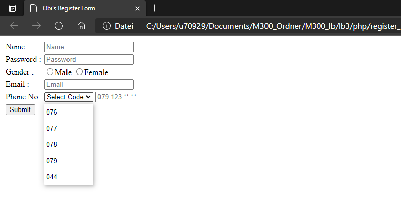

# M300 Lernbeurteilung 3 | Markdown Dokumentation
### von Obinna Maduabum    
---
# Inhaltsverzeichnis
* Einleitung
  * Service Beschreibung
  * Anforderung
  * Sicherheit
* Docker VM erzeugen
* PHP & Apache Dienst installieren
  * Docker-compose File
*  MySql Dienst Installieren
   *  Docker File Image
   *  Docker-Compose File
* Create HTML Form Page
* Connect Form to Database
* Grafische Übersicht
* Testing
  * PHP + Apache
  * MySQL
  * Service Anwendung
* Angewendete Befehle
* Quellenangaben
* Fazit


# Einleitung

### **Service Beschreibung**
Mein Ziel ist es eine Webformular anhand PHP und Apache zu erstellen und wenn man diese Formular ausfüllt, werden die Daten in meiner MySQL Datenbank gespeichert. <p>
Ich beginne indem ich eine PHP-Apache Dienst starte und eine einfache Webseite anzeigen lassen. Wenn dies funktioniert, werde ich einen eigenen Docker Image erstellen, worin die PHP-Apache Dienst mit den vom MySQL verknüpft ist. Nachdem ich die Verbindung bestätigen kann, werde ich dann die Webformular erstellen und es so konfigurieren, dass die eingegebene Daten in mein erstellte Datenbank gespeichert werden. 

### **Anforderungen** <p>
Um diese Setup aufzubauen habe ich folgendes zur Verfügung gestellt.
  * Vagrant
  * Docker (inkl. Docker-compose)
  * Git hub/lab
  * Git bash
  * Visual Studio Code
  * Virtualbox
  * Speicherplatz für die VMs
<p> 

### **Sicherheit**

Um meine Container zu schützen habe ich den Least Privilege Prinzip angewendet. Das heisst, dass jeder Prozess und Container mit so viel Zugriffsrechten und Ressourcen laufen, wie er gerade braucht. Wegen diesen Gründe, habe ich sichergestellt, dass alle Prozesse in meine Containeren **nicht** als "root" laufen. Somit sichere ich dass, das Ausnutzen von Sicherheitslücken in einem Prozess, einem Angreifer keine root-Berechtigung gibt.

Zusätzlich habe ich meine Container abgesichert, indem sie in einer VM laufen, um zu vermeiden, dass andere Benutzer oder Services angegriffen werden können.

## Docker VM Erzeugen
___
###  **VM Ordner für Docker VM erzeugen**
In gewünschtem Verzeichnis einen neuen Ordner für die VM anlegen:

  > ``cd m300_lb/lb3``<br>
  > ``mkdir DockerVM``<br>

Um den Docker Virtuelle Maschine zu erzeugen habe ich Vagrant benutzt. Ich habe einen Vagrantfile verwendet den der Lehrer für uns zur Verfügung gestellt hat .<br>

Die Netzwerk Einstellung wurde vom Lehrer vorgegeben.

###  **Docker-Compose Kommando installieren**
Damit die "Docker-Compose" Befehl angewendet kann, muss dies im Docker VM noch installiert werden:
> ``sudo curl -L "https://github.com/docker/compose/releases/download/1.23.2/docker-compose-$(uname -s)-$(uname -m)" -o /usr/local/bin/docker-compose`` <p>

Danach noch die Berechtigung anpassen (ausführbar machen):<br>
>``sudo chmod +x /usr/local/bin/docker-compose``

### **Docker VM für Test**

Um meine Umgebung zu starten müssen Sie die den Docker VM von meinen Vagrantfile verwenden.
In diese VM befinden sich dann alle benötigte Files und Ressourcen, damit die Container und Prozesse erfolgreich erstellt werden können.
Die Vagrantfile befindet sich in Verzeichnis "DockerVM" also hier: https://github.com/Obi1Chris/M300_lb/tree/main/lb3/DockerVM

## PHP und Apache Dienst installieren
___

### **Verzeichnis für Umgebung anlegen**

Für die ganze Umgebung werde ich einen neuen Verzeichnis anlegen und in dies wechseln.
 >``mkdir obi_dc_test`` <br>
 >``cd obi_dc_test/``

### **Docker Compose YAML File erstellen**

```Ruby
version: '3.3'
services:
    web:
       image: php:7.3-apache
       container_name: php73
       volumes:
         - ./php:/var/www/html/
       ports:
         - 8000:80
```
Den Image ist eine PHP Dienst der inklusive als Apache Webserver verwendet werden kann. <br>
Ich habe einen Volume erstellt, die den lokallen Verzeichnis "/php" auf den Remote Verzeichnis "/var/www/html/" verknüpft.<br>
Ich habe einen Port Forwarding vom Port 8000 zur Port 80 konfiguriert. Somit muss ich nur den Port 8000 angeben und es wird intern auf Port 80 weitergeleitet. <br>

  
## MySQL Dienst installieren
___

### **Dockerfile Image**

Anstatt den bisher verwendete php-apache Image werde ich einen Image selbst erstellen, die zusätzlich noch eine MySQL Support anbietet.<br>
Dafür werde ich einen Dockerfile erstellen:

```Ruby
FROM php:7.3.3-apache
RUN apt-update && apt-get upgrade -y
RUN docker-php-ext-install mysqli
EXPOSE 80
```

### **Custom Image für Docker-compose File**
Ich werde meine custom Image nun am Docker-compose file hinzufügen:
```Ruby
version: '3.3'
services:
    web:
      build: 
        context: ./php
        dockerfile: Dockerfile
      container_name: php73
      volumes:
        - ./php:/var/www/html/
      ports:
        - 8000:80
    
```

### **MySQL Konfiguration**

Nun werde ich im compose file noch eine zweite Docker Container erstellen für den MySQL Datenbank.

```Ruby
db:
      container_name: mysql8
      image: mysql:8.0
      command: --default-authentication-plugin=mysql_native_password
      restart: always
      environment: 
        MYSQL_ROOT_PASSWORD: root
        MYSQL_DATABASE: Obi_test_db
        MYSQL_USER: Obisql 
        MYSQL_PASSWORD: obipass123
    ports: 
        - 6033:3306
```
#### **Code Beschreibung**
Als Authentifizierung möchte ich einen native Passwort verwenden den ich angeben werde.<br>
Mit ``restart: always`` wird der Container immer neu gesstartet, wenn er manuell angehalten wird oder der Docker-Daemon selbst neu gestartet wird.<br>
Im ``environment`` setze ich bestimmte Variabeln wie Root Passwort, Datenbank Name, DB User, und DB Passwort.<br>
Mit der Port "6033" wird die Verbindung zu unseren lokalen SQL Port auf "3306" weitergeleitet.<p>

Nun werde ich dies testen und zwar im Testing , MySQL Service

## Verknüpfung MySQL Service mit PHP
___

Mein Ziel ist, dass ich den PHP Apache Service mit dem MySQL Service verbinde. <br>
Dabei soll es möglich sein die Daten eines vorhandenes Datenbank auf die Webseite anzuzeigen. Um zu testen, dass dies möglich wäre, habe ich den PHP Index File angepasst, so dass er eine Verbindung zum MySQL Server beweisen kann. Wenn die Verbindung erfolgreich aufgebaut wurde, dann steht auf der Website "Connection Successfull" ansonsten "Connection Failed".<br>
Damit dies überhaupt möglich ist, muss ich die Container verknüpfen. Dies mache ich indem ich der PHP Container abhängig vom MySQL Container mache:
```Ruby
depends_on:
      - db
```

### **MySQL Connection in PHP**
Jetzt erstelle ich im PHP Index File eine Verbindung. Anhand ``IF`` und ``ELSE`` Kriterien wird eine Bestätigung der Verbindung auf der Webseite angezeigt.
```Ruby
<?php
$host = 'db'; 
$user = 'Obisql';
$password = 'obipass123';
$db = 'Obi_test_db';

$conn = new mysqli($host,$user,$password,$db);
if($conn->connect_error){
    echo 'connection failed' . $conn->connect_error;
}
echo 'successfully connected to Obi`s MYSQL';

?>
```
# Web Formular Integration

Wie in der Einleitung beschrieben, möchte ich, dass eine ausgefüllte Webformular, in meiner MySQL Datenbank gespeichert wird. Dafür benötige ich zuerst den Web Formular. In den nächsten Schritten werde ich dies erstellen und danach mit der Datenbank verbinden.

### **HTML Form für Datenbank erstellen**
Ich habe nun einen HTML Form erstellt, die Angaben zur eine Person abfragt.
```Ruby
<!DOCTYPE HTML>
<html>
<head>
  <title>Obi's Register Form</title>
</head>
<body>
 <form action="insert.php" method="POST">
  <table>
   <tr>
    <td>Name :</td>
    <td><input type="text" placeholder="Name" name="username" required></td>
   </tr>
   <tr>
    <td>Password :</td>
    <td><input type="password" placeholder="Password" name="password" required></td>
   </tr>
   <tr>
    <td>Gender :</td>
    <td>
     <input type="radio" name="gender" value="m" required>Male
     <input type="radio" name="gender" value="f" required>Female
    </td>
   </tr>
   <tr>
    <td>Email :</td>
    <td><input type="email" placeholder="Email" name="email" required></td>
   </tr> 
   <tr>
    <td>Phone No :</td>
    <td>
     <select name="phoneCode" required>
      <option selected hidden value="">Select Code</option>
      <option value="076">076</option>
      <option value="077">077</option>
      <option value="078">078</option>
      <option value="079">079</option>
      <option value="044">044</option>
     </select>
     <input type="phone" placeholder="079 123 ** **" name="phone" required>
    </td>
   </tr>
   <tr>
    <td><input type="submit" value="Submit" name="submit"></td>
   </tr>
  </table>
 </form>
</body>
</html>
```
Nun Sieht die Formular so aus: <p>


### **Code Beschreibung**
Ich werde auf die HTML Code Beschreibung verzichten und nur das erklären was für die Verbindung auf meiner Datenbank wichtig ist.

Im obigen Code sieht man ``<form action="insert.php" method="POST"> ``wo ich in action insert.php schreibe, was bedeutet, dass ich meine Formulardaten an insert.php senden. Ich werde mehr auf den insert.php File eingehen und dort auch die wichtige Zeilen im HTML Form erklären

## Formular Eingaben in Datenbank speichern
___
Damit die Daten vom ausgefüllte Formular in der Datenbank gespeichert wird, habe ich eine seperaten File erstellt die insert.php heisst. Ich werde die Code Beschreibung in Sektionen teilen, damit dies verständlicher ist.


### **Variabeln setzen**


In Zeile 3 prüfen ich, ob ``$username, $password, $gender, $email, $phoneCode und $phone``  gesetzt sind oder nicht. Wenn diese nicht gesetzt sind, gehen es bis zu Zeile 55. <br>
 <br>
Somit müssen alle Angaben im Formular ausgefüllt werden, damit es abgeschickt werden kann. <br>
Wenn diese gesetzt sind, wird der Code aus Zeile 7 ausgeführt. <br>

Mit dem Code von Zeile 7 bis 12 werden die Daten aus dem HTML-Formular abgerufen und in PHP-Variablen gespeichert:  ``$username, $password, $gender, $email, $phoneCode and $phone`` 

### **Datenbank Verbindung herstellen**


Von Zeile 14 bis Zeile 17 setze ich die Variabeln ( $host, $dbUsername, $dbPassword und $dbname) und weise ihr einen Wert zum Verbinden unser Datenbank ``"Obi_test_db"`` zu.

Dann, in Zeile 19, stelle ich eine Datenbankverbindung her und weise sie in ein $conn Variable.

Danach prüfen ich in Zeile 21, ob meine Datenbank verbunden ist. Wenn es keine Verbindung gibt, zeigt es einen Fehler an und beendet den Service. Wenn eine Datenbank verbunden ist, geht es ab Zeile 24 weiter.

### **SQL-Abfrage in einer Variablen deklarieren**


In Zeile 25 befindet sich eine SELECT-Abfrage zur Auswahl von Daten aus einer Datenbank und in Zeile 26 eine INSERT-Abfrage zum Einfügen von Benutzerdatensätzen in eine Datenbank.

In Zeile 28 führe ich eine SELECT-Abfrage aus.

In Zeile 29 übergebe ich einen E-Mail-Wert in eine SELECT-Abfrage und ich definieren "s", weil E-Mail eine String ist. 

In einer SELECT-Abfrage wählen ich nur E-Mail aus, also fangen ich in Zeile 31 diesen E-Mail-Wert ab.

In Zeile 34 speichere ich die Anzahl der Zeilen in einer Variablen $rnum aus unserem Ergebnis.

### **Einfügen von Benutzerdaten**


Dann prüfen ich in Zeile 36, ob den Ergebnis 0 Zeilen enthält. Wenn ja, fahrt es mit der Programmierung fort, wenn nicht, geht es in Zeile 48 weiter und gibt die Meldung "Someone already registered using this email" aus.

Wenn das Ergebnis null Zeilen enthält, dann bedeutet das, dass die Daten dieses Benutzers noch nicht in meiner Datenbank gespeichert sind. Also kann ich diesen Datensatz in meiner Datenbank als neuen Benutzer speichern. Aber zuerst muss ich eine prepared statement für die SELECT-Abfrage schliessen und eine prepared statement für eine INSERT-Abfrage starten.

Und nachdem die Daten in die Datenbank eingefügt wurden, gibt es eine Meldung "New record inserted sucessfully" aus.

Die Letzte else Funktion, ist falls den Submit button nicht gesetzt wird.

# Grafische Übersicht 


# Testing

## PHP + Apache
Um den Docker-compose File zu testen werde ich einen einfachen php Website File erstellen und dies vom Host PC anzeigen lassen.<br>
Wenn ich alles richtig konfiguriert habe sollte ich mit der ip Adresse "192.168.60.101" und der Port "8000" auf der Webserver erlangen.<br>

In php Verzeichnis wechseln und einen html file für die Webseite anlegen:

  > ``cd php/``<br>
  > ``nano index.php``<br>
  > 

PHP Container anhand Docker-compose yaml file starten.

  > ``docker-compose up``<br>

Nachdem der Dienst gestartet wird. Auf Host PC die entsprechende IP Adresse und Port eingeben:

   

## MySQL Service
Für den Test werde ich einen docker compose up führen um meine Docker-compose File zu überprüfen.

### **Error 1**
Es kam folgender Meldung: <br>
 <br>
Nachdem ich etwas recherchiert habe, habe ich festgestellt, dass das Problem beim Einrücken der Docker-compose File lag.<br>
Neu sieht ist es nun so aus:
```Ruby
version: '3.3'
services:
  web:
    build: 
      context: ./php
      dockerfile: Dockerfile
    container_name: php73
    volumes:
      - ./php:/var/www/html/
    ports:
      - 8000:80
  db:
    container_name: mysql8
    image: mysql:8.0
    command: --default-authentication-plugin=mysql_native_password
    restart: always
    environment: 
      MYSQL_ROOT_PASSWORD: root
      MYSQL_DATABASE: Obi_test_db
      MYSQL_USER: Obisql 
      MYSQL_PASSWORD: obipass123
    ports: 
      - 6033:3306
```
Jetzt hat es geklappt mit den ports mapping, aber jz habe ich eine andere Error erhalten.

### **Error 2**
Jetzt erschien folgender Meldung: <br>
 <br>

Diesmal ist der Fehler Meldung vom Dockerfile des Images. Und zwar im zweiten Zeile:
```Ruby
RUN apt-update && apt-get upgrade -y
```
Das ist ein Syntax Fehler von mir. Es sollte ``apt-get update`` heissen und nicht ``apt-update``.<br>
Dies habe ich angepasst und nochmals ``docker-compose up`` ausgeführt.

Nun funktioniert alles fehlerfrei:<br>
 <br>


### **Verknüpfung MySQL in PHP Webseite**
Mein Ziel ist, dass ich den PHP Apache Service mit dem MySQL Service verbinde. <br>
Dabei soll es möglich sein die Daten eines vorhandenes Datenbank auf die Webseite anzuzeigen. Um zu testen, dass dies möglich wäre, habe ich den PHP Index File angepasst, so dass er eine Verbindung zum MySQL Server beweisen kann. Wenn die Verbindung erfolgreich aufgebaut wurde, dann steht auf der Website "Connection Successfull" ansonsten "Connection Failed".

 <br>

## Service Anwendung
Da werde ich die verschiedene IF/ELSE statements in meiner Code testen. <br>
Am Schluss teste ich das Speichern von Daten in meiner Datenbank.

### **Alle Felder nötig**
Zuerst teste ich was passiert, wenn ich nicht alle Felder ausfülle:


Wie man sieht kann man den Formular nicht abgeben und es erscheint die Fehlermeldung "Füllen Sie dises Feld aus".

###  **New Record Success**
Wenn alles richtig ausgefüllt worden ist sollte eine positive Meldung erscheinen:


Jetzt, dass dies bestätigt wurde, gehe ich im MySQL Shell und schaue ob die eingegebene Daten gespeichert worden sind. <br>

Zuerst logge ich mich ein:


Der Root Passwort lautet: "root" <br>

Nun kann ich die Vorhanden Tabelle in meiner Datenbank anzeigen lassen:


### **Schlusswort Testing**

Wie man sieht waren alle Tests erfolgreich. Somit sind alle meine Ziele erreicht. <p>

# Angewendete Befehle

Hier werde ich Befehle dokumentieren, die ich benutzt habe.

### **Docker Befehle**
|Commands                   |Meaning                                                           |
|---------                  |:--------                                                         |
|   ``docker-compose up ``  |Builds, creates, starts, and attaches to containers for a service |
|    ``docker build``       | Build an image from the Dockerfile in the current directory      |
|   ``docker image ls``     | List all images that are locally stored with the Docker Engine   | 
### **Vagrant Befehle**

|Commands               |Meaning                                                               |
|---------              |:--------                                                             |
|   ``vagrant up``      |   Creates a Virtualbox VM based on the setting in the vagrantfile    |
|   ``vagrant ssh``     | Creates a SSH Connection to the running Vagrant VM                   |
|   ``vagrant destroy`` |   Destroys a Vagrant VM in the current folder (if there is one)      |


### **Git Befehle**
|Commands               |Meaning                                                               |
|---------              |:--------                                                             |
|   ``git add ``        |   Add a change to the staging list (to be committed)                 |
|    ``git commit``     |   make all changes in the staging list permanent.                    |
|   ``git push``        |   Pushes all changes to the remote git Repository                    |


</p>

# Quellenangaben

[Docker Images](https://hub.docker.com/search?image_filter=official&type=image) <p>
[MySQL Tutorial](https://www.youtube.com/watch?v=91iNR0eG8kE) <p>
[HTML Form](https://www.codeandcourse.com/connect-register-form-to-mysql-with-php) <p>
[Verbindung Formular zur DB](https://www.youtube.com/watch?v=qm4Eih_2p-M) <p>
[Apache, PHP & MySQL on Docker](https://www.youtube.com/watch?v=_mwWxgfZ7Zc&t=470s) <p>
[Docker-compose Installation](https://www.digitalocean.com/community/tutorials/how-to-install-and-use-docker-compose-on-centos-7) <p>
[Create MySQL Table using PHP](https://www.w3schools.com/php/php_mysql_create_table.asp) <p>
[MySQL Docker Container Tutorial](https://phoenixnap.com/kb/mysql-docker-container) <p>

[Markdown Anleitung](https://www.ionos.de/digitalguide/websites/web-entwicklung/markdown/) <p>

# Fazit

Allgemein habe ich diesen Projekt sehr spannend gefunden und ich denke ich konnte wirklich was mitnehmen, denn mir in Zukunft auch helfen kann. Vor dem Projekt habe ich Docker nur ein wenig gekannt. Obwohl ich schon wusste was Containers sind, habe ich anhand diesen Projekt ganz genau den Unterschied zu einen normalen Virtuelle Maschine verstehen. Dank die spannende Screencasts der Lehrer konnte ich die verschiedene Themen viel besser und schneller verstehen.  


___
<li>Made by Obinna Maduabum</li>
<li>Made for a school Project </li>
<li> ST18e - Modul 300 LB3</li>
<li>&copy; May 2021</li>